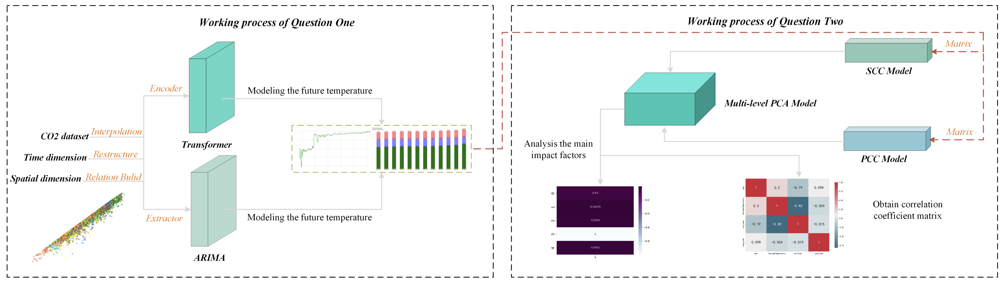
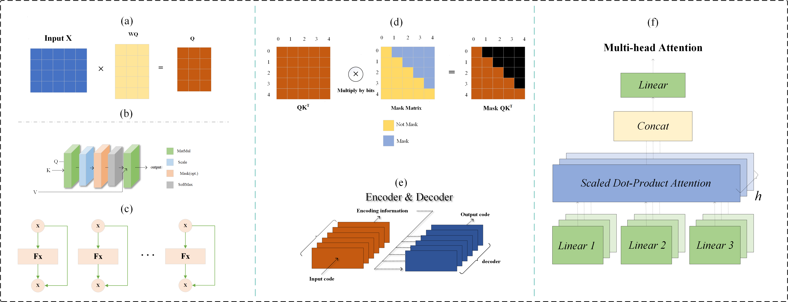

# Data-Driven-Global-Climate-Forecasting-APMCM-2022
Asia and Pacific Mathematical Contest in Modeling (APMCM) – National First Prize - 2022

## Data-Driven-Global-Climate-Forecasting-APMCM
[📄[Document](https://github.com/ffengc/Data-Driven-Global-Climate-Forecasting-APMCM)] &emsp; [💻[Platform](https://pytorch.org/)] &emsp;  
[🌅[Code](https://github.com/ffengc/Data-Driven-Global-Climate-Forecasting-APMCM)] &emsp; [📖[Paper](https://ffengc.github.io/Data-Driven-Global-Climate-Forecasting-APMCM/paper.pdf)] &emsp; 

## Problem

The problem can be seen in [The Problem C](https://ffengc.github.io/Data-Driven-Global-Climate-Forecasting-APMCM/ProblemC/2022APMCMProblemC.pdf).

## Summary

In recent years, the rising trend of temperature in many countries has become more
and more obvious. In this paper, we mainly use multiple statistics and neural networks
to establish an explainable fitting model of the global temperature change trend and
use some optimized correlation coefficient methods to dig out key factors affecting
global warming. Finally, some scientific plans and suggestions are given based on the
established global warming analysis and prediction model.

Aiming at problem 1, we first collect the global temperature data from 2013
to 2022 and conduct a multi-level difference analysis. It is found that 30-50 years
after the industrial revolution (1793-1812) is the period of the most drastic temperature change. Secondly, we use Transformer model, ARIMA model, and optimized **ARIMA (ARIMA-LSTM)** model to effectively fit the historical data and they all conducted the **Interpretable Modeling** respectively. Then, based on the well-trained models, we inject the historical data and obtain the temperature prediction data for 2050 and 2100 respectively. The modeling results of ARIMA found that the global temperature will reach the threshold of 20 ° C in 2055, and the transformer model found that it will exceed 20°C for the first time in 2048.

Aiming at problem 2, we first add the collected CO2 dataset. Then Spearman
Correlation Coefficient **(SCC)**, Pearson Correlation Coefficient **(PCC)**, and Multi-level
Principal Component Analysis **(MPCA)** are then respectively applied to our model
processing, and the results show that the correlation of spatial dimensional characteristics is the strongest. Then, we also collect other natural disaster data and they are then also reranked. It is found that the impact of temperature rise caused by CO2 is obvious.

Aiming at problem 3, based on the above conclusions, we summarized and reviewed
the full text, and summarized the generation, development, influencing factors, and
preventive measures of global warming. Finally, from the time dimension and space
dimensions, we put forward some suggestions and initiatives to slow down global
warming.

**Keywords:** Transformer neural network, Interpretable modeling, ARIMA-LSTM, Multi-level principal component analysis, Spearman correlation coefficient Pearson
correlation coefficient

## The paper

The paper can be seen in [📖[Paper](https://ffengc.github.io/Data-Driven-Global-Climate-Forecasting-APMCM/paper.pdf)].

The pipeline of our proposed model, which can handle multiple types of data and
give the main influencing factors.

The whole workflow of each part of the transformer, which includes six effective
blocks (from a to f)